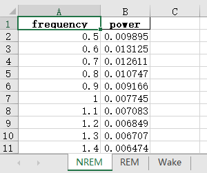

## MiSleep scripts

Some scripts about MiSleep

### Time correction
Updata: 2024-01-30

When you forgot to change the acquisition time when first time create the label file, and you had already labeled some data, you can use the `time_correction.py` to change the acquisition time of your label file

- **Usage**

Firstly please ensure that you have python on your computer.
Download the `time_correction.py` file to your own computer. You need to prepare two arguments, one is the label file path, another is the acquistion time you want to reset, use the `YYYY-MM-DD hh:mm:ss` format for the acquisition time.
Run the following in your command (`cmd` when you use Windows).

```shell
python PATH_TO_TIME_CORRECTION.PY/time_correction.py PATH_TO_YOUR_LABEL_FILE/LABEL.txt NEW_ACQUISITION_TIME

# Here is an example, when you put the time_correction.py and
# the label file in the same directory, and now you are in the directory.
python time_correction.py label.txt 2024-01-30 13:20:20
```

And if you want to know how it works, check the `time_correction.ipynb`, which you can open with `jupyter notebook`, I covered each step in detail in that file.

### Transfer result
Update: 2024-01-31

Transfer the label file to an EXCEL sheet, which will help you do the downstream analysis. It is **almost** the same 
with that one in the MiSleep tools.

Download the `transfer_result.py` to your computer, and execute:
```shell
python PATH_TO_TRANSFER_RESULT.PY/transfer_result.py PATH_TO_YOUR_LABEL_FILE/LABEL.txt

# Here also we provide a optional argument, which is the result file's name, see:
# e.g. No specific result file name, the result file's name will be same with your label file
python transfer_result.py label.txt
# e.g. Specify a name for result file
python transfer_result.py label.txt result.xlsx 
```

Since the scripts are much more convenient to update than MiSleep software, I highly recommend to use the 
scripts version but not MiSleep version.

### Data to Spectrum
Update: 2024-03-01

Analyze the selected signal channel, convert to the spectrum of different states (NREM, REM, Wake, Init if exist). Will output 3 (or 4) figures, which are the spectrums of each state.
And a excel with 3 (or 4) sheets, within each sheet is the raw data of spectrum, the first column is `frequency`, and second columns is `relative power`, you can use them to plot on other platforms (e.g. Graphpad). 


Download the `data2spectrum.py` and edit the parameters in the `0. Arguments` part, run the python script you will get the output.
