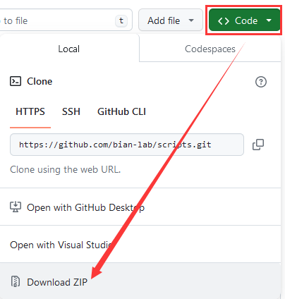
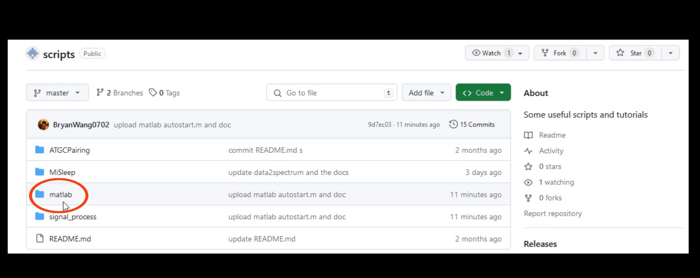

# Scripts

Some scripts, check each folder for details.

### Get start
Considering you have no experience with `git`, here are some simple steps to get start.

1. If you want to check all the scripts, follow this:

2. If you just want to download a single script, here is a example with `autostart.m`.

After downloading the scripts, you can run on your own computer.
